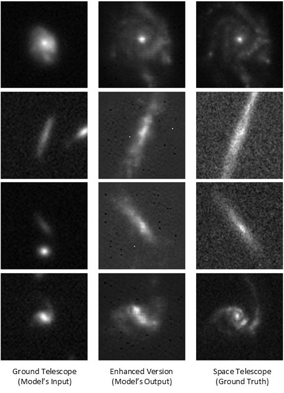
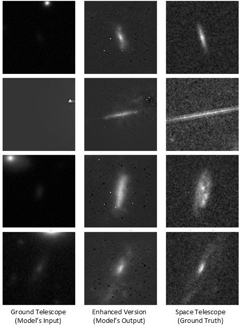

# 🌌 Galaxy Enhancer

> **Amplifying the imaging power of ground-based telescopes with space-based telescopes data and generative AI.**

This project facilitates the download of ground-based telescope imagery based on celestial coordinates (RA/Dec), converts it into a usable image format, and enhances it by utilizing contextual information from space-based telescopes using a custom-trained Conditional Generative Adversarial Network (cGAN).

The cGAN model was trained on paired images from ground-based and space-based telescopes, with the goal of transforming ground-based observations to match the quality and clarity of space-based imagery.

---

## ✨ Features

- 🔭 Input celestial coordinates (RA, Dec)
- 📡 Download raw **FITS** files from public astronomical databases
- 🖼️ Convert FITS to 8-bit **TIF** format
- 🤖 Enhance the image using a pre-trained **cGAN (Conditional GAN)** model
- 💾 Save the enhanced image in `.png` format

---

## 📷 Sample Outputs

Here are some sample outputs from our model, demonstrating its ability to enhance ground-based images to a quality that closely resembles space-based observations. Impressively, the model maintains high performance even when the input lacks clear visual details of the galaxy.

<p align="center">
  
  
</p>


---

## 📊 Data Availability

The cGAN model, train dataset and a catalog of 63,202 enhanced images are available at: [https://doi.org/10.6084/m9.figshare.30226591](https://doi.org/10.6084/m9.figshare.30226591)

---

## 🚀 Getting Started

### 1. Clone the Repository

```bash
git clone https://github.com/SaiTeja-Erukude/Enhancing-Ground-Based-Astronomy-using-GenAI.git
cd galaxy-enhancer
```

### 2. Set Up a Virtual Environment

```bash
python3.8 -m venv .venv
.venv\Scripts\activate  # For Windows
```

### 3. Install Dependencies

```bash
pip install -r requirements.txt
```

## 🛰️ Usage
```bash
python main.py
```